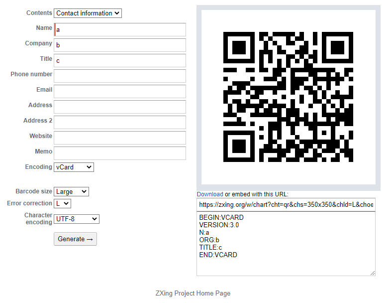
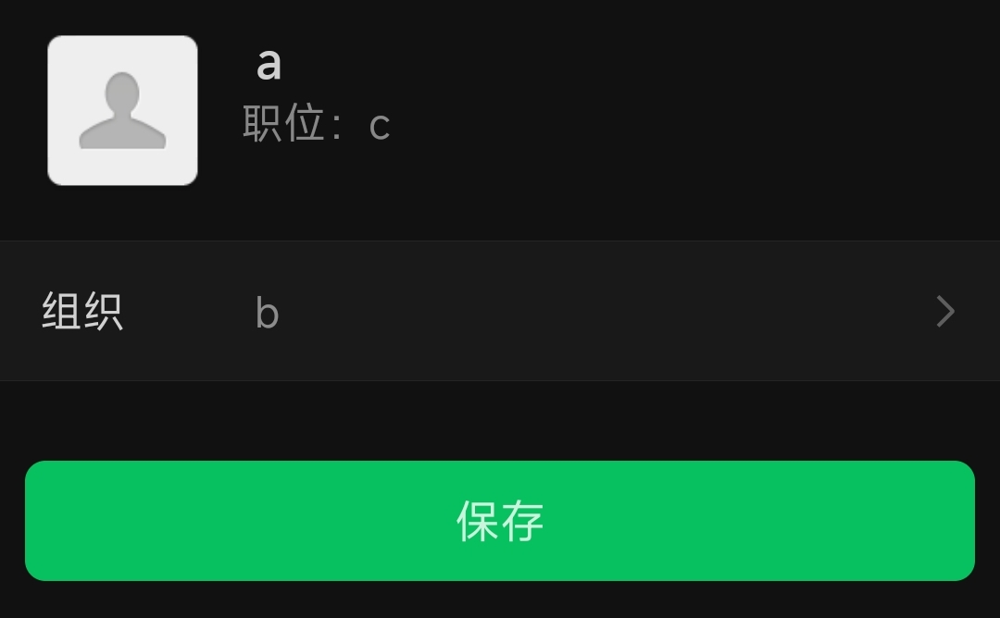

## 简介

二维码是现在移动互联网特别流行的基础设施之一。

本文尝试介绍二维码的相关技术知识。

并编程实践，生成二维码，解析（扫描）二维码。

## 开始

酷壳有一篇文章介绍二维码原理，[《二维码的生成细节和原理》](https://coolshell.cn/articles/10590.html)。推荐大家现在去看一下。

维基百科上的介绍，也是必读的。 [《QR code - Wikipedia》](https://en.wikipedia.org/wiki/QR_code) 

根据维基百科的介绍，二维码是1994年由日本公司 Denso Wave 的 Masahiro Hara 发明的。他的灵感来自于围棋棋盘。

酷壳提到的官方规范文档链接 http://raidenii.net/files/datasheets/misc/qr_code.pdf ，已经打不开了。

这个链接 https://www.qrcode.com/en/about/standards.html 是二维码规范化过程的说明。

我在这个链接 https://github.com/yansikeim/QR-Code/blob/master/ISO%20IEC%2018004%202015%20Standard.pdf 找到ISO IEC 18004 2015 Standard 标准文档。 可供查阅技术细节。

## 什么是二维码

二维码正式说法是QR Code。中文俗称叫它二维码。毕竟二维码对应的英语翻译应该是two-dimensional Code, 2D Code。QR全称Quick Response，快速响应的意思。所以，QR Code的中文翻译可以叫它快速响应矩阵图码。

在一些场合下，它用来取代Bar Code条形码（一维码），提供更丰富的信息。

### 存储

二维码有40种尺寸，官方说法叫40种版本。

分为是 21×21，25×25，29×29，…… 177×177。

#### 最大容量

V40版本（177×177），L级纠错，可以存储的容量是：

- 数字 7089
- 数字字母 4296
- 字节 2953
- 日文（Kanji，采用Shift JIS） 1817
- 中文 984（采用UTF-8），1,800（采用BIG5/GB2312）

**这个是怎么算出来的呢？**

177 * 177 = 31,329 这是bits

再除以8，31329 / 8 = 3916.125 ，大约 3916 个字节

再去掉定位区，以及至少7%的冗余，结果大约 3000 个字节。

大致如此。

### 纠错

二维码有很强的纠错能力。所以，即使有一些破损、模糊，在一定程度下，不影响识别。

它有4种纠错级别

- L级 7%的字码可被修正
- M级 15%的字码可被修正
- Q级 25%的字码可被修正
- H级 30%的字码可被修正

## 技术细节

如何生成图片，很多复杂，详细见酷壳的文章，这里不展开了。

## 编程实现

现在开始写代码来实现二维码的生成和解析吧。

### ZXing

打开ZXing网站 https://github.com/zxing/zxing ，查看说明。

ZXing ("zebra crossing")，是开源的一维码、二维码图像处理库。用Java实现。并与其他语言对接。

### 用工具生成二维码

ZXing网站提到了一个二维码生成网站 https://zxing.appspot.com/generator 。

我们可以通过它生成电子名片二维码。



这是我生成一张二维码。把它下载下来。接下来，我们写程序来解析它。

### 编程解析二维码

在ZXing网站上没找到用户指南。我们试试ChatGPT能不能帮我们写一下这个程序。

可以的。下面是我根据ChatGPT的回答，调整后的代码。

```java
public class QRDecoder {

    public static void main(String[] args) throws IOException, NotFoundException, URISyntaxException {
        // 读取二维码图片
        File file = new File(QRDecoder.class.getResource("/qr.png").toURI());
        BufferedImage image = ImageIO.read(file);

        // 转换为ZXing能够解析的类型
        LuminanceSource source = new BufferedImageLuminanceSource(image);
        BinaryBitmap bitmap = new BinaryBitmap(new HybridBinarizer(source));

        // 尝试解析二维码
        Result result = new MultiFormatReader().decode(bitmap);
        System.out.println("解析结果： " + result.getText());
    }
}
```

运行结果：

```
解析结果： BEGIN:VCARD
VERSION:3.0
N:a
ORG:b
TITLE:c
END:VCARD
```

成功。

### 编程生成二维码

我们再来问问ChatGPT，能不能写一个生成二维码的程序。

这次，ChatGPT依然没有让我们失望。

下面是我整理后代码

```java
public class QRCodeGenerator {

    public static void main(String[] args) throws IOException, WriterException {
        String text = "BEGIN:VCARD\n" +
                "VERSION:3.0\n" +
                "N:a\n" +
                "ORG:b\n" +
                "TITLE:c\n" +
                "END:VCARD";

        generateQRCodeImage(text, 350, 350, "C:/tmp/qr.png");
    }

    public static void generateQRCodeImage(String text, int width, int height, String filePath)
            throws WriterException, IOException {
        QRCodeWriter qrCodeWriter = new QRCodeWriter();
        BitMatrix bitMatrix = qrCodeWriter.encode(text, BarcodeFormat.QR_CODE, width, height);

        Path path = new File(filePath).toPath();
        MatrixToImageWriter.writeToPath(bitMatrix, "PNG", path);
    }
}
```

为了省事，我就没有把`text`单独放在文件里再读取了。

运行之后，我在`C:\tmp`找到了`qr.png`这张图片，拿手机一扫，结果如下：



成功。

## 最后

我们的二维码编程之旅就先到这边。

完成的项目代码，我已经上传到 https://github.com/zachthinking/demos/tree/main/qrcode-demo 。欢迎取用。


有任何问题欢迎留言与我交流。